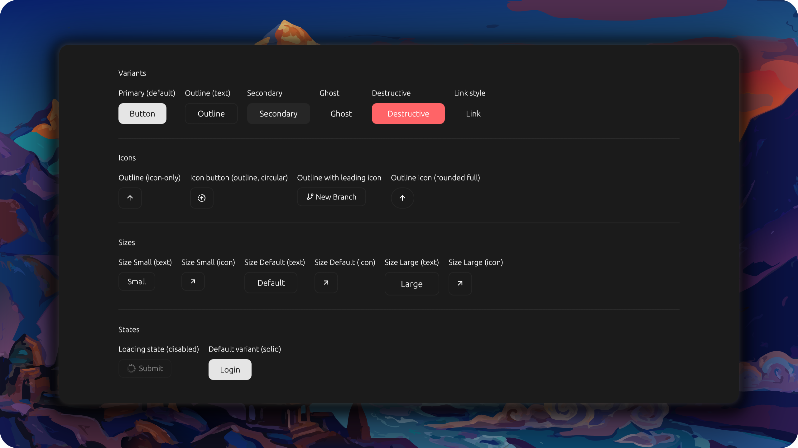

# Button Example

<p align="center">
  <picture>
    
  </picture>
</p>

Demonstrates the `Button` component with variants, sizes, icons, and states.

## Features

- **Variants**: Primary (default), Outline, Secondary, Ghost, Destructive, Link
- **Icons**: Icon-only buttons, leading icons with text, circular icons, rounded full radius
- **Sizes**: Small, Default, Large (text and icon variants)
- **States**: Loading state (disabled), enabled/disabled
- Organized in sections with labels and separators

## Run

```bash
cargo run --example button
```
