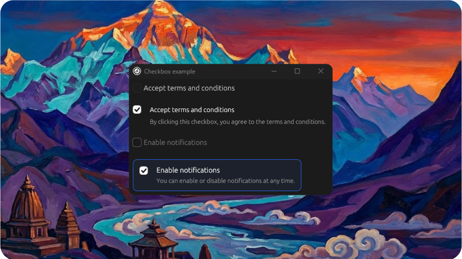

# Checkbox Example

<p align="center">
  <picture>
    
  </picture>
</p>

Demonstrates the `Checkbox` component with labels and descriptions.

## Features

- Checkbox with inline label ("Accept terms and conditions")
- Checkbox with separate label and description text
- Disabled checkbox
- Checkbox in custom frame with border and background (clickable frame area)

## Run

```bash
cargo run --example checkbox --features examples
```
