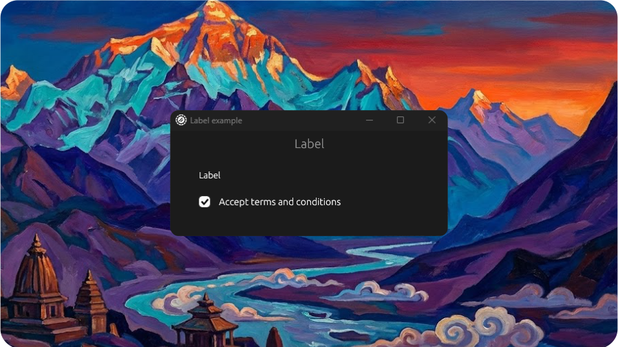

# Label Example

<p align="center">
  <picture>
    
  </picture>
</p>

Demonstrates the `Label` component placed in a grid card with a linked checkbox.

## Features

- Label + checkbox: “Accept terms and conditions”.

## Run

```bash
cargo run --example label --features examples
```
