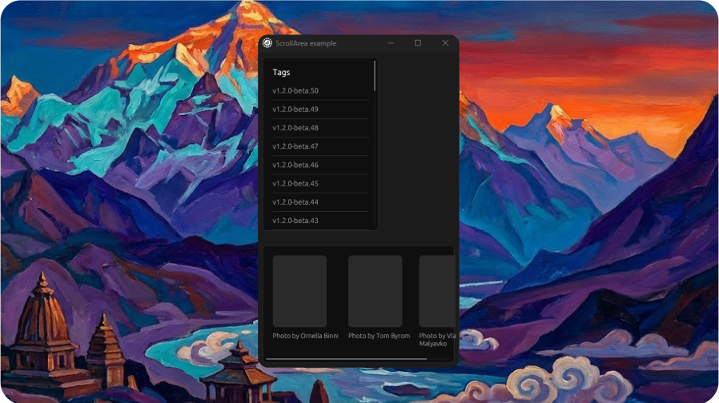

# Scroll Area Example

<p align="center">
  <picture>
    
  </picture>
</p>

Demonstrates the `ScrollArea` component with vertical and horizontal scrolling.

## Features

- Vertical scroll area with tag list (50 items with separators)
- Horizontal scroll area with image gallery (3 items)
- Both scroll areas wrapped in frames with borders

## Run

```bash
cargo run --example scroll_area --features examples
```
