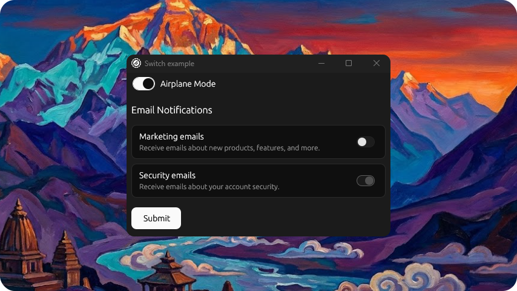

# Switch Example

<p align="center">
  <picture>
    
  </picture>
</p>

Demonstrates the `Switch` component in a settings interface.

## Features

- Simple switch with label ("Airplane Mode")
- Section header ("Email Notifications")
- Two switches in framed containers with titles and descriptions:
  - Marketing emails (enabled)
  - Security emails (disabled)
- Submit button

## Run

```bash
cargo run --example switch
```
