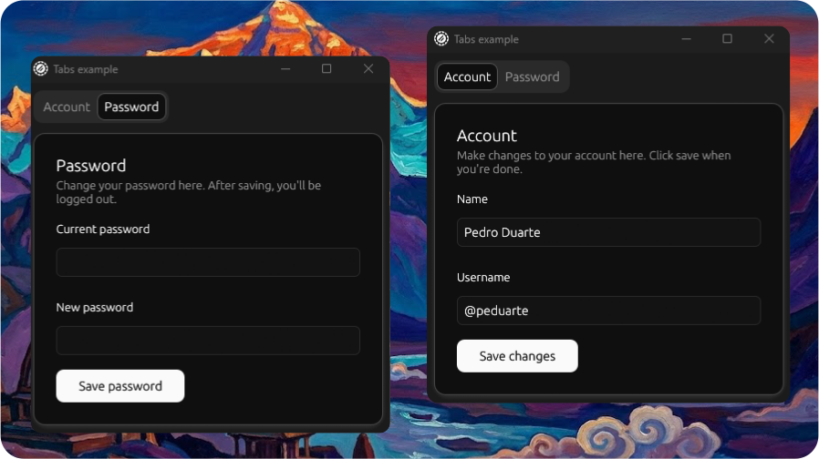

# Tabs Example

<p align="center">
  <picture>
    
  </picture>
</p>

Demonstrates the `Tabs` component with card content and form fields.

## Features

- Soft variant tabs with two tabs (Account, Password)
- Account tab: card with name and username inputs, save button
- Password tab: card with current and new password inputs, save button

## Run

```bash
cargo run --example tabs  
```
