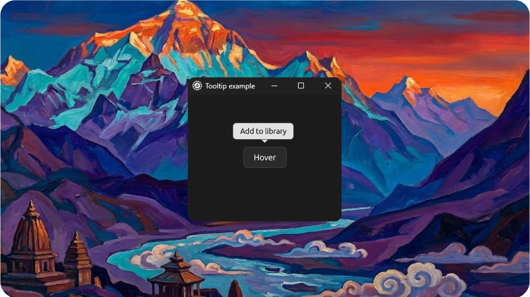

# Tooltip Example

<p align="center">
  <picture>
    
  </picture>
</p>

Demonstrates the `Tooltip` component with basic hover interaction.

## Features

- Button with tooltip on hover ("Add to library")

## Run

```bash
cargo run --example tooltip --features examples
```
